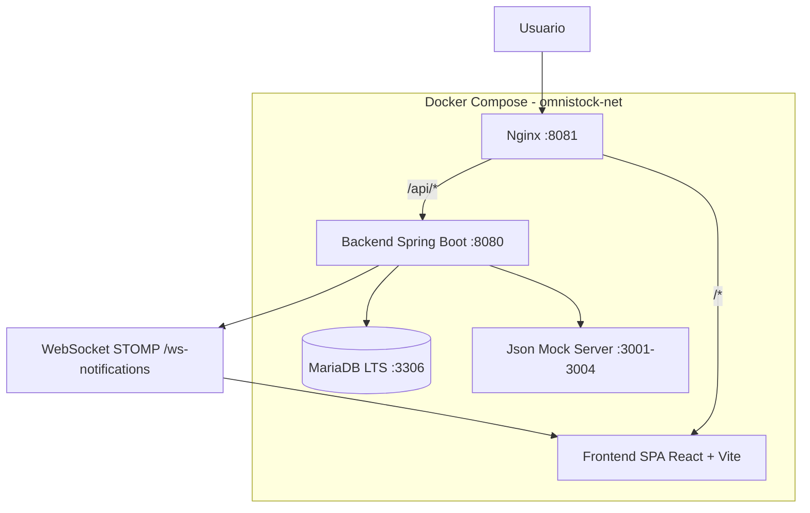

# OmniStock — Stock multicanal y presupuestos B2B

### Plataforma full stack para inventario consolidado y simulación de órdenes de compra

**OmniStock** es una solución integral para la **gestión de stock multicanal** y la **simulación de presupuestos B2B** a partir de catálogos de múltiples proveedores. Originalmente concebida como una aplicación interna, este repositorio representa un **port a plataforma full stack** con una arquitectura moderna, escalable y containerizada.

> **El equipo original éramos 3 personas**: yo (backend, lógica de negocio, contenedorización, evolución técnica, integración frontend con API) y dos compañeros (maquetación y diseño visual). Lo desarrollé en poco tiempo gracias a que me encargué al 100% del backend.

---

## Acceso Rápido

| Recurso | URL |
|---------|-----|
| **Frontend** | http://localhost:8081 |
| **Swagger UI** | http://localhost:8080/swagger-ui.html |
| **Health Check** | http://localhost:8080/actuator/health |

### Credenciales de Prueba

| Usuario | Contraseña | Rol |
|---------|-----------|-----|
| `admin` | `admin123` | ADMIN |
| `cliente` | `cliente123` | CLIENTE |

> **Nota**: El login usa el **nombre de usuario** (no el email). Las contraseñas son en minúsculas.

---

## Tabla de Contenidos

- [Mi Rol y Enfoque como Desarrollador Backend](#mi-rol-y-enfoque-como-desarrollador-backend)
- [Diseño de Arquitectura](#diseño-de-arquitectura)
- [Backend — Capas y Componentes](#backend--capas-y-componentes)
- [Testing Riguroso](#testing-riguroso)
- [Código Limpio y Mantenible](#código-limpio-y-mantenible)
- [En números](#en-números)
- [Características Clave e Impacto](#características-clave-e-impacto)
- [Impacto en la Empresa](#impacto-en-la-empresa)
- [Arquitectura del Sistema](#arquitectura-del-sistema)
- [Behavior-Driven Development (BDD)](#behavior-driven-development-bdd)
- [Tests](#tests)
- [Tecnologías Utilizadas](#tecnologías-utilizadas)
- [Endpoints de la API](#endpoints-de-la-api)
- [Cómo Ejecutar el Proyecto](#cómo-ejecutar-el-proyecto)
- [Cuentas de Prueba](#cuentas-de-prueba)
- [Estructura del Proyecto](#estructura-del-proyecto)
- [Flujos Principales](#flujos-principales)
- [Documentación Adicional](#documentación-adicional)

---

## Mi Rol y Enfoque como Desarrollador Backend

> **OmniStock es un port de un proyecto de empresa.** Partiendo de una aplicación interna funcional, formé parte de un equipo de tres desarrolladores donde me centré al 100% en el backend. Mi labor fue diseñar e implementar una API REST moderna que reemplazara la lógica dispersa del proyecto original, aplicando principios de arquitectura limpia, resiliencia empresarial y testing riguroso.

Participé activamente en la **toma de decisiones arquitectónicas**, el **diseño e implementación del backend**, la **contenedorización con Docker** y la **mejora sustancial** del proyecto original de empresa.

### Mi Contribución al Proyecto

Yo definí:

1. **La arquitectura modular por capas** (Controller → Service → Repository → DTOs) siguiendo principios SOLID
2. **Toda la lógica de negocio**: sincronización de catálogos, simulación de presupuestos, analytics BI, resiliencia empresarial
3. **El sistema de permisos granulares** con matriz por rol (49 permisos, 2 roles)
4. **La contenedorización con Docker** (5 servicios con healthchecks)
5. **El pipeline CI/CD** con tests, lint, typecheck y smoke tests
6. **La integración del frontend con la API** (Axios interceptors, WebSocket STOMP)

### Definición de la Lógica de Negocio para Permisos y Flujos de Proceso

#### Sistema de Permisos Nominales

OmniStock implementa **49 permisos nominales** organizados en 9 módulos funcionales. Cada permiso representa una acción específica que un usuario puede (o no) realizar en el sistema.

**Ejemplos de permisos:**
- `productos.sincronizar` — Solo ADMIN puede iniciar sincronización masiva de catálogos
- `proveedores.crear` — Solo ADMIN puede dar de alta nuevos proveedores
- `dashboard.ver` — ADMIN y CLIENTE pueden ver el resumen ejecutivo
- `analytics.ver` — ADMIN y CLIENTE pueden consultar las 10 métricas BI
- `usuarios.gestionar` — Solo ADMIN puede gestionar usuarios del sistema

> 📖 Para el catálogo completo de los 49 permisos, consulta [`permisos.md`](docs/permisos.md).

#### Matriz de Permisos por Rol

| Rol | Acceso a lectura | Acceso a escritura | Gestión usuarios | Analytics | Presupuestos |
|-----|-----------------|-------------------|-----------------|-----------|--------------|
| **ADMIN** | ✅ Todo | ✅ Todo | ✅ Completa | ✅ Completo | ✅ Completo |
| **CLIENTE** | ✅ Productos, dashboard, analytics | ❌ | ❌ | ✅ Solo lectura | ✅ Propios |

De los 49 permisos totales:
- **29 son compartidos** (ADMIN + CLIENTE)
- **20 son exclusivos** de ADMIN

#### Alcance de Datos (Scope)

El sistema actualmente implementa un alcance **global** (sin segmentación por sucursal o departamento):

| Dimensión | Estado | Descripción |
|-----------|--------|-------------|
| `branchId` | ❌ No implementado | Todos los usuarios ven los mismos datos |
| `visibleBranchIds` | ❌ No implementado | No hay filtro por sucursal |
| `departmentId` | ❌ No implementado | No hay filtro por departamento |

> **Nota**: El alcance por sucursal/departamento está planificado para una futura evolución. Actualmente, el sistema es multi-sede pero sin restricciones de visibilidad por sede.

#### Flujos de Proceso

| Flujo | Descripción |
|-------|-------------|
| **Política de contraseñas** | BCrypt (strength=12), Jakarta Validation en DTOs, cambio vía perfil propio |
| **Eliminación (soft/hard delete)** | Hard delete en todas las entidades. User tiene campo `activo` para soft delete futuro |
| **Sincronización de catálogos** | Async con `@Async`, estados IDLE→IN_PROGRESS→COMPLETED/ERROR, estados parciales |
| **Simulación de presupuestos** | Validación de stock ≥ cantidad, cantidad ≥ MOQ, ciclo BORRADOR→FINALIZADO→APROBADO/RECHAZADO |
| **Resiliencia** | Circuit Breaker (5 fallos/10s → open 30s), Retry (3 intentos, backoff exponencial), TimeLimiter (10s), DLQ |
| **Notificaciones** | In-app vía WebSocket STOMP, conteos, marcado individual/masivo, limpieza automática |

#### Trazabilidad con Auditoría

- **SyncLog**: Cada sincronización registra proveedor, timestamp, estado, productos procesados y errores
- **PriceHistory**: Cada cambio de precio queda registrado con valor anterior, nuevo y timestamp
- **DeadLetterQueue**: Mensajes fallidos con payload original, timestamp y causa del error
- **Notificaciones**: Cada evento importante genera una traza de auditoría visible al usuario

> 📖 Para más detalles sobre reglas de negocio, consulta [`businessLogic.md`](docs/businessLogic.md).

---

## Diseño de Arquitectura

### Arquitectura por Capas (Layered Architecture)

> **Aclaración importante**: Este backend sigue una **arquitectura por capas (Layered Architecture)** clásica, no Clean Architecture ni Domain-Driven Design. No hay separación hexagonal, puertos/adaptadores, ni un núcleo de dominio aislado de la infraestructura. Es una arquitectura pragmática y efectiva para APIs REST empresariales, donde cada capa tiene una responsabilidad bien definida y las dependencias fluyen de arriba abajo.

### Arquitectura Modular por Dominios

El backend está organizado en **módulos funcionales**, cada uno con su propia estructura de Controller/Service/Repository/DTOs:

| Módulo | Responsabilidad |
|--------|----------------|
| **auth** | Autenticación JWT, login, register, refresh, validate |
| **users** | CRUD de usuarios, gestión de roles, perfil propio |
| **products** | Inventario, catálogo de productos, búsqueda con filtros |
| **suppliers** | CRUD de proveedores, dashboard con KPIs, gestión de mapeos |
| **mappings** | Reglas de transformación JSON (4 estrategias: DIRECT, NESTED, FIND_IN_ARRAY, SPLIT) |
| **dashboard** | Resumen ejecutivo, supplier health KPIs, exportación CSV |
| **analytics** | 10 métricas BI con queries nativas (price variation, stockout, dispersion, etc.) |
| **budget** | Simulación de presupuestos, ciclo de vida, exportación Excel |
| **price-history** | Historial de precios, analytics, tendencias, comparativas |
| **notifications** | Notificaciones in-app, WebSocket STOMP, conteos, limpieza |
| **sync** | Sincronización asíncrona de catálogos, estados, DLQ |
| **transformation** | Estrategias de mapeo JSON (UniversalMapperService + 4 implementaciones) |
| **integration** | Cliente HTTP con Resilience4j, Circuit Breaker, Retry |
| **shared** | Utilidades compartidas (CurrencyRateService, tipos de cambio) |
| **config** | Configuración global (Security, CORS, WebSocket, OpenAPI, Cache) |

### Patrones de Diseño Implementados

| Patrón | Dónde se usa | Propósito |
|--------|-------------|-----------|
| **Facade** | `StockServiceImpl` | Unifica `StockQueryService` + `StockCatalogSyncService` + `MasterProductService` bajo una sola interfaz `IStockService` |
| **Strategy** | `TransformationStrategy` (4 implementaciones) | Cada proveedor tiene un formato JSON distinto. El `UniversalMapperService` selecciona la estrategia según el `ProviderMapping` |
| **Template Method** | `SeederRoleSupport` | Los seeders que necesitan roles siguen un flujo común: buscar rol → si no existe, crearlo → usarlo |
| **DTO/Projection** | `PriceDispersionProjection`, `TradingOpportunityProjection` | Proyecciones nativas con `@Query` que evitan cargar entidades completas |
| **Generic Response** | `ApiResponse<T>` | Wrapper genérico con `success`, `message`, `data`, `timestamp`, `metadata`, `errors` |
| **Repository Pattern** | 16 repositorios Spring Data JPA | Abstracción de persistencia con queries derivadas y `@Query` nativas |

---

## Backend — Capas y Componentes

### Middleware

| # | Middleware | Propósito |
|---|-----------|-----------|
| 1 | **JwtAuthenticationFilter** | Intercepta cada request, extrae token del header `Authorization: Bearer`, valida firma HMAC-SHA256, establece el `SecurityContext` |
| 2 | **SecurityConfig** | Configura reglas de autorización por endpoint via `requestMatchers` + `@PreAuthorize` |
| 3 | **CORS** | Configura `allowedOriginPatterns`, métodos y headers para el frontend |
| 4 | **GlobalExceptionHandler** | `@ControllerAdvice` que captura cualquier excepción no manejada y la envuelve en `ApiResponse` |
| 5 | **Validation** | Jakarta Validation (`@Valid`) en DTOs de entrada con mensajes de error en español |

### Capa de Módulos

Cada módulo sigue esta estructura de carpetas:

```
modulo/
├── controller/      # Controladores REST
├── service/         # Lógica de negocio
├── repository/      # Acceso a datos (Spring Data JPA)
├── dtos/            # Objetos de transferencia de datos
├── entity/          # Entidades JPA (a nivel global)
└── util/            # Utilidades del módulo
```

### Módulos Destacados

| Módulo | Descripción |
|--------|-------------|
| **Auth** | Login JWT con claims personalizados (sub, roles, fullName, jti, iss, aud), refresh token, validación |
| **Products** | CRUD con paginación, búsqueda por filtros (categoría, proveedor, precio, specs), sincronización asíncrona |
| **Suppliers** | CRUD con dashboard de KPIs (total SKUs, stock medio, precio medio, productos activos, últimos 5) |
| **Analytics** | 10 endpoints BI con queries nativas SQL y proyecciones JPA |
| **Budget** | Simulación con validación de stock y MOQ, ciclo de vida, exportación Excel con Apache POI |
| **Notifications** | In-app con WebSocket STOMP, conteos en tiempo real, limpieza automática programada |

### Capa de Configuración

| Configuración | Archivo | Propósito |
|---------------|---------|-----------|
| **Database** | `application.properties` | Conexión MariaDB, pool HikariCP, Flyway migrations |
| **Environment** | `.env` | Variables de entorno (DB credentials, JWT secret, CORS origins) |
| **Logger** | SLF4J + Logback | Logging estructurado con niveles DEBUG/INFO/WARN/ERROR |
| **WebSocket** | `WebSocketConfig.java` | Configuración STOMP/SockJS para notificaciones en tiempo real |
| **Cache** | `CacheConfig.java` | Caffeine Cache con TTL de 5 minutos |
| **Resilience** | `application-resilience.properties` | Circuit Breaker, Retry, TimeLimiter |
| **Security** | `SecurityConfig.java` | JWT filter, CORS, CSRF disabled, session stateless |
| **OpenAPI** | `OpenApiConfig.java` | Swagger UI con springdoc-openapi |

### Seguridad

| Capa | Tecnología | Detalle |
|------|-----------|---------|
| **Autenticación** | JWT (HMAC-SHA256) | Claims: sub, roles, fullName, jti, iat, exp, iss, aud. Expiración: 150 min |
| **Autorización** | Spring Security + `@PreAuthorize` | 49 permisos, 2 roles (ADMIN, CLIENTE) |
| **Scope** | Global | Sin segmentación por sucursal/departamento (planificado) |
| **CSRF** | Deshabilitado | API stateless con JWT |
| **Validación** | Jakarta Validation | DTOs validados con `@Valid` y mensajes en español |
| **Hash contraseñas** | BCrypt | Strength=12 |
| **Encriptación** | AES-256/GCM | Credenciales de proveedores (API keys, contraseñas) |
| **Rate Limiting** | No implementado | Planificado para futura versión |
| **Política contraseñas** | Jakarta Validation | Validación en registro y cambio de contraseña |
| **Account Lockout** | No implementado | Planificado para futura versión |

---

## Testing Riguroso

> **311 tests backend + 175 tests frontend = 486 tests totales**

Mi filosofía es: **si no está testeado, no está terminado.**

### Estrategia de Testing

| Tipo | Tecnología | Cobertura |
|------|-----------|-----------|
| **Unitarios puros** | JUnit 5 + Mockito | Cada servicio aislado sin Spring Context |
| **Integración** | Spring Boot Test + H2 | Repositorios y flujos completos |
| **Arquitectura** | ArchUnit | Verifica dependencias entre capas |
| **BDD** | Nomenclatura Given-When-Then implícita | Tests con mensajes descriptivos en español |
| **Cobertura** | JaCoCo | 74% global (seeders excluidos) |
| **Smoke tests** | PowerShell + curl | 14 endpoints post-deploy |

### Distribución de Tests por Módulo

#### Backend (311 tests — 74% cobertura)

| Servicio | Tests | Cobertura | Casos clave |
|----------|-------|-----------|-------------|
| `UserService` | 18 | 100% | CRUD, duplicados, contraseña, perfil |
| `SupplierService` | 14 | 100% | CRUD, dashboard, encriptación |
| `ProviderMappingService` | 10 | 100% | CRUD mapeos, validación estrategias |
| `StockCatalogSyncService` | 10 | 100% | Paginación, estados parciales, errores |
| `ProductSupplierService` | 12 | 100% | Relaciones, ofertas, stock |
| `SyncStateService` | 9 | 100% | Estados IDLE/IN_PROGRESS/COMPLETED/ERROR |
| `ApiClientService` | ~10 | 100% | Circuit Breaker, retry, timeouts |
| `DeadLetterQueueService` | 12 | 100% | Encolar, reintentar, limpiar |
| `PriceHistoryService` | 12 | 100% | Historial, analytics, tendencias |
| `DashboardService` | ~10 | 100% | Summary, stale, top movers |
| `SupplierHealthService` | ~8 | 100% | SLA, latency, error rate |
| `ExportService` | 8 | 100% | Exportación ZIP con CSVs |
| `NotificationService` | 14 | 100% | Crear, leer, marcar, limpiar |
| `EncryptionService` | 9 | 100% | Cifrar/descifrar AES-256 |
| `CurrencyRateService` | 3 | 100% | Tasas, conversión |
| `ArchitectureTest` | ~5 | — | ArchUnit (no aplica cobertura) |

#### Frontend (175 tests — 100% servicios)

| Archivo | Tests | Descripción |
|---------|-------|-------------|
| `authService.test.ts` | 2 | Servicio de login |
| `dashboardService.test.ts` | 2 | Dashboard summary |
| `analyticsService.test.ts` | 10 | Analytics API |
| `supplierHealthService.test.ts` | 2 | Health de proveedores |
| `productService.test.ts` | 7 | CRUD productos |
| `supplierService.test.ts` | 9 | CRUD proveedores |
| `userService.test.ts` | 5 | CRUD usuarios |
| `notificationService.test.ts` | 5 | Notificaciones |
| `budgetService.test.ts` | 8 | Presupuestos |
| `api.test.ts` | 12 | Interceptores Axios |
| `api.coverage.test.ts` | 3 | Cobertura api.ts |
| `AuthContext.test.tsx` | 10 | Contexto de autenticación |
| `BudgetContext.test.tsx` | 10 | Contexto de presupuesto |
| `exportPurchaseOrder.test.ts` | 5 | Exportación Excel |
| `formatting.test.ts` | 7 | Formateo de moneda |
| `useDebounce.test.ts` | 6 | Hook debounce |
| `useFieldErrors.test.ts` | 7 | Hook errores de campo |
| Componentes UI | ~50 | Badge, Pagination, DataTable, etc. |

---

## Código Limpio y Mantenible

- **Modularidad**: 15 módulos funcionales con responsabilidad única, cada uno con su propia estructura de carpetas
- **Validación centralizada**: Jakarta Validation en DTOs con mensajes en español + `GlobalExceptionHandler` que captura y formatea errores
- **Manejo de errores**: Excepciones personalizadas (`RegistrationConflictException`, `ResourceNotFoundException`, `SyncInProgressException`) con `ApiResponse<T>` genérico
- **Logging estructurado**: SLF4J con niveles DEBUG/INFO/WARN/ERROR, incluyendo IDs de sincronización y tiempos de ejecución
- **Tipado fuerte**: TypeScript en frontend, Java con tipos genéricos en backend
- **Constantes centralizadas**: Rutas API, mensajes de error, configuración JWT en archivos dedicados
- **Inyección por constructor**: Todos los servicios usan constructor injection (sin `@Autowired` directo)
- **Perfiles Spring**: `application.properties` (dev), `application-prod.properties` (producción), `application-resilience.properties` (Resilience4j), `application-test.properties` (H2)

---

## En números

| Métrica | Backend (mi foco) | Frontend |
|---------|-------------------|----------|
| **Tests** | 311 | 175 |
| **Suites de test** | 16 servicios + 1 arquitectura | 8 servicios + 7 contextos/componentes |
| **Cobertura** | 74% (JaCoCo) | 100% servicios / ~18.85% global |
| **Módulos funcionales** | 15 | 9 features |
| **Endpoints REST** | 54 | — |
| **Middleware** | 5 (JWT filter, Security, CORS, ExceptionHandler, Validation) | 2 (Axios interceptors, ProtectedRoute) |
| **Permisos** | 49 (29 compartidos + 20 exclusivos ADMIN) | Renderizado condicional con `isAdmin` |
| **Patrones de diseño** | 5 (Facade, Strategy, Template, DTO/Projection, Generic Response) | Context API, Custom Hooks |
| **Seguridad** | JWT (HMAC-SHA256) + AES-256/GCM + BCrypt + Spring Security | JWT en localStorage + rutas protegidas |
| **Entidades JPA** | 17 | — |
| **Repositorios** | 16 | — |
| **Queries nativas** | 12 (analytics + dashboard) | — |
| **Líneas de código** | ~8,500 (Java, excluyendo tests) | ~5,000 (TypeScript/TSX) |

---

## Características Clave e Impacto

### Arquitectura y UX Operativa

- **Arquitectura en capas** (Controller → Service → Repository → DTOs) siguiendo principios SOLID
- **Migración** de una aplicación interna monolítica a una API REST moderna con servicios asíncronos y colas de mensajes
- **Interfaz limpia y funcional**: El frontend actual ofrece una experiencia de usuario sin sobrecarga visual, con navegación intuitiva y feedback en tiempo real vía WebSocket

### Contenedorización

- **Docker Compose** con 5 servicios: MariaDB, Backend, Frontend, Mock Server, Log Reset
- **Multi-stage build** en Dockerfile para optimizar el tamaño de la imagen final
- **Healthchecks** en todos los servicios críticos (MariaDB, Backend, Mock Server)
- **Reverse proxy** con Nginx para servir el frontend estático
- **Red Docker** `omnistock-net` para conectividad entre contenedores

### Seguridad

- Autenticación JWT con HMAC-SHA256 y refresh tokens (150 min de expiración)
- 49 permisos nominales con matriz por rol (ADMIN/CLIENTE)
- Hash de contraseñas con BCrypt (strength=12)
- Encriptación AES-256/GCM para credenciales de proveedores
- Validación de entrada con Jakarta Validation
- CORS configurado para el frontend
- WebSocket STOMP con autenticación JWT
- Logging estructurado con SLF4J

### CI/CD

- **GitHub Actions** con pipeline completo:
  1. **Lint**: ESLint en frontend (0 warnings)
  2. **Typecheck**: TypeScript strict mode
  3. **Tests**: Backend (Maven test) + Frontend (Vitest)
  4. **Build**: Maven package + Vite build
  5. **Smoke tests**: 14 endpoints post-deploy vía PowerShell

---

## Impacto en la Empresa

### Beneficios Cuantificables

| Métrica | Impacto |
|---------|---------|
| **Centralización de datos** | Elimina silos de información entre departamentos |
| **Automatización de sincronización** | Reduce horas hombre en actualización manual de catálogos |
| **Presupuestos en línea** | Acelera el ciclo de cotización de días a minutos |
| **Visibilidad del inventario** | Dashboard en tiempo real reduce roturas de stock |
| **Analytics predictivos** | Identifica productos obsoletos y oportunidades de compra |
| **Exportación automatizada** | Elimina errores de transcripción en órdenes de compra |
| **Seguridad empresarial** | Cumplimiento con estándares de encriptación y control de acceso |
| **Resiliencia** | El sistema sigue funcionando aunque un proveedor externo esté caído |

### Valor Diferencial

1. **Reglas de negocio robustas**: 49 permisos nominales, matriz por rol, flujos de proceso con validaciones
2. **Escalabilidad**: Arquitectura preparada para crecer horizontalmente (backend stateless, Docker Compose)
3. **UX real**: Interfaz sin sobrecarga visual, feedback en tiempo real, navegación intuitiva
4. **Calidad validada**: 486 tests (311 backend + 175 frontend), 74% cobertura, CI/CD con smoke tests
5. **Trazabilidad**: Historial completo de precios, logs de sincronización, auditoría de eventos

---

## Arquitectura del Sistema

### Diagrama de Arquitectura



### Stack Técnico Completo

#### Backend
| Tecnología | Versión | Propósito |
|-----------|---------|-----------|
| Java | 21 | Lenguaje principal |
| Spring Boot | 3.2.5 | Framework principal |
| Spring Security | 6.x | Autenticación y autorización |
| Spring Data JPA | 3.x | Persistencia y repositorios |
| Hibernate | 6.x | ORM |
| MariaDB | LTS (11.8) | Base de datos relacional |
| H2 | 2.x | Base de datos para tests |
| Resilience4j | 2.2.0 | Circuit Breaker, Retry, TimeLimiter |
| Caffeine Cache | 3.x | Caché en memoria (TTL 5 min) |
| Flyway | 10.x | Migraciones de base de datos |
| SpringDoc OpenAPI | 2.5.0 | Documentación Swagger automática |
| JJWT | 0.12.5 | JWT (HMAC-SHA256) |
| Apache POI | 5.2.5 | Generación de Excel |
| JUnit 5 | 5.x | Testing |
| Mockito | 5.x | Mocks para tests |
| ArchUnit | 1.3.0 | Tests de arquitectura |
| JaCoCo | 0.8.12 | Cobertura de código |

#### Frontend
| Tecnología | Versión | Propósito |
|-----------|---------|-----------|
| React | 18 | Framework UI |
| TypeScript | 5.2 | Tipado estático |
| Vite | 5.1 | Build tool |
| React Router | 6.30 | Enrutamiento SPA |
| TanStack React Query | 5.90 | Data fetching y caché |
| Axios | 1.6 | Cliente HTTP con interceptores JWT |
| Recharts | 3.7 | Gráficos del dashboard |
| STOMP + SockJS | 7.0 | WebSockets para notificaciones |
| ExcelJS | 4.4 | Exportación a Excel |
| Framer Motion | 12.34 | Animaciones |
| Lucide React | 0.575 | Iconos |
| Vitest | 2.0 | Testing |
| Testing Library | 16.0 | Testing de componentes |

#### Infraestructura y DevOps
| Tecnología | Versión | Propósito |
|-----------|---------|-----------|
| Docker | latest | Contenedorización |
| Docker Compose | v2 | Orquestación de servicios |
| Nginx | latest | Reverse proxy |
| GitHub Actions | — | CI/CD pipeline |

### Capas Principales

| Capa | Contenido |
|------|-----------|
| **App (código de negocio)** | `backend/` (Spring Boot) + `frontend/` (React + Vite) |
| **Infra (operación/despliegue)** | `infra/` (json-mock-server) |
| **Orquestación** | `docker-compose.yml` (5 servicios) |

---

## Behavior-Driven Development (BDD)

El desarrollo del backend se guió por principios de **Behavior-Driven Development**, asegurando que cada funcionalidad implementada tuviera su correspondiente batería de tests que validaran el comportamiento esperado.

### Principios Aplicados

1. **Los tests describen comportamiento, no implementación**: Cada test lleva un mensaje declarativo en español que describe qué debería ocurrir (ej: `"debe lanzar excepción cuando el username ya existe"`)
2. **Cobertura de caminos felices y casos borde**: No solo se prueba el flujo principal, sino también errores, valores límite y condiciones excepcionales
3. **Aislamiento total**: Todos los tests usan mocks (Mockito) para aislar la unidad bajo prueba
4. **Nomenclatura Given-When-Then implícita**: La estructura de cada test sigue el patrón: preparación (given) → ejecución (when) → verificación (then)

### Resultados

| Módulo | Tests | Cobertura |
|--------|-------|-----------|
| **Backend (Spring Boot)** | **311 tests** | **74%** (JaCoCo) |
| Frontend — Servicios | 175 tests | 100% |
| Frontend — Global | 175 tests | ~18.85% |

> **Nota**: Los seeders del backend fueron excluidos intencionadamente de los tests por ser código de inicialización de datos, no lógica de negocio.

---

## Tests

### Backend (311 tests — 74% cobertura)

```bash
# Ejecutar todos los tests
cd backend
./mvnw test

# Ejecutar tests con cobertura (JaCoCo)
./mvnw verify

# Ver reporte de cobertura
# Abrir backend/target/site/jacoco/index.html en el navegador

# Ejecutar un test específico
./mvnw test -Dtest=SupplierServiceTest

# Ejecutar tests de un paquete
./mvnw test -Dtest="com.omnistock.backend.service.*"
```

### Frontend (175 tests — 100% servicios)

```bash
# Ejecutar todos los tests
cd frontend
npx vitest run

# Ejecutar tests en modo watch (para desarrollo)
npx vitest

# Ejecutar tests con cobertura
npx vitest run --coverage

# Ver reporte de cobertura
# Abrir frontend/coverage/index.html en el navegador
```

### Smoke Tests (Post-Deploy)

```powershell
# Windows
.\tests\test-postman.ps1

# Linux/macOS
bash ./tests/test-postman.sh
```

El script automatiza la verificación completa del despliegue:
1. Login JWT con credenciales por defecto
2. Prueba 14 endpoints autenticados (dashboard, analytics, productos, proveedores)
3. Valida respuestas con `success: true`
4. Reporte visual con código de colores

---

## Tecnologías Utilizadas

### Backend
**Java 21**, **Spring Boot 3.2.5**, Spring Security, Spring Data JPA, Hibernate, **MariaDB LTS (11.8)**, H2, **Resilience4j**, Caffeine Cache, Flyway, SpringDoc OpenAPI, JWT (HMAC-SHA256), BCrypt, AES-256/GCM, Apache POI, **JUnit 5**, Mockito, ArchUnit, JaCoCo.

### Frontend
**React 18**, **TypeScript**, **Vite**, React Router v6, **TanStack React Query**, Axios, Recharts, STOMP + SockJS, ExcelJS, Framer Motion, Lucide React, **Vitest**, Testing Library.

### Infraestructura
**Docker**, **Docker Compose**, Nginx, **GitHub Actions**.

---

## Endpoints de la API

### Autenticación (`/api/v1/auth`)

| Método | Endpoint | Descripción |
|--------|----------|-------------|
| POST | `/auth/login` | Iniciar sesión (devuelve JWT) |
| POST | `/auth/register` | Registrar nuevo usuario (rol CLIENTE) |
| GET | `/auth/validate` | Validar si un token sigue siendo válido |
| POST | `/auth/refresh` | Renovar token JWT |

### Productos (`/api/v1/productos`)

| Método | Endpoint | Descripción |
|--------|----------|-------------|
| GET | `/productos/` | Listar productos (paginado, ordenable) |
| GET | `/productos/search` | Buscar productos con filtros (query, categoría, proveedor, specs) |
| GET | `/productos/{id}` | Detalle completo del producto con ofertas por proveedor |
| GET | `/productos/{id}/historial/{proveedorId}` | Historial de precios del producto con un proveedor |
| POST | `/productos/sync-all` | Iniciar sincronización masiva de catálogos (background) |
| GET | `/productos/sync-status` | Estado actual de la sincronización (IDLE/IN_PROGRESS/COMPLETED/ERROR) |

### Proveedores (`/api/v1/proveedores`)

| Método | Endpoint | Descripción |
|--------|----------|-------------|
| GET | `/proveedores/list` | Lista simple (id, nombre) para desplegables |
| GET | `/proveedores/` | Listar todos los proveedores con todos los campos |
| GET | `/proveedores/{id}` | Detalle del proveedor |
| GET | `/proveedores/{id}/dashboard` | Dashboard con KPIs del proveedor |
| POST | `/proveedores/` | Crear un nuevo proveedor |
| PUT | `/proveedores/{id}` | Actualizar datos del proveedor |
| DELETE | `/proveedores/{id}` | Eliminar proveedor |
| GET | `/proveedores/{id}/mappings` | Mapeos de campos del proveedor |
| POST | `/proveedores/{id}/mappings` | Crear regla de mapeo |
| PUT | `/mappings/{id}` | Actualizar regla de mapeo |
| DELETE | `/mappings/{id}` | Eliminar regla de mapeo |

### Dashboard (`/api/v1/dashboard`)

| Método | Endpoint | Descripción |
|--------|----------|-------------|
| GET | `/dashboard/summary` | Resumen ejecutivo: totales, disponibilidad, gráficos, zombies, proveedores caídos |
| GET | `/dashboard/supplier-health` | KPIs de salud operativa de proveedores (SLA Score, Sync Success Rate, Latency, Error Rate) |
| GET | `/dashboard/export/excel` | Descargar Excel (.xlsx) con datos del dashboard |

### Analytics BI (`/api/v1/analytics`)

| Método | Endpoint | Descripción |
|--------|----------|-------------|
| GET | `/analytics/price-variation` | Variación mensual del índice de precios por proveedor (LAG) |
| GET | `/analytics/stockout-rates` | Tasa de ruptura de stock por proveedor |
| GET | `/analytics/price-dispersion` | Dispersión de precios entre proveedores por SKU |
| GET | `/analytics/moq` | Distribución de MOQ por proveedor |
| GET | `/analytics/condition-mix` | Mezcla de condiciones de producto por proveedor |
| GET | `/analytics/cost-coverage` | Cobertura de proveedor por SKU (riesgo proveedor único) |
| GET | `/analytics/stock-volatility` | Índice de volatilidad de stock (24h) |
| GET | `/analytics/catalog-growth` | Tendencia de crecimiento del catálogo (semanal) |
| GET | `/analytics/price-stability` | Score de estabilidad de precio por SKU/proveedor |
| GET | `/analytics/trading-opportunities` | Oportunidades de trading: productos con margen positivo entre coste y PVP |

### Presupuestos (`/api/v1/budget`)

| Método | Endpoint | Descripción |
|--------|----------|-------------|
| POST | `/budget/simulate` | Simular presupuesto con líneas de producto |
| GET | `/budget` | Listar presupuestos del usuario autenticado |
| GET | `/budget/{id}` | Obtener detalle de un presupuesto por ID |
| PUT | `/budget/{id}/status` | Actualizar estado del presupuesto |
| DELETE | `/budget/{id}` | Eliminar presupuesto |
| POST | `/budget/{id}/export` | Notificar exportación de presupuesto |

### Historial de Precios (`/api/v1/historial-precios`)

| Método | Endpoint | Descripción |
|--------|----------|-------------|
| GET | `/historial-precios/producto/{id}/proveedor/{id}` | Historial de precios de un producto con un proveedor |
| GET | `/historial-precios/producto/{id}` | Historial de precios de un producto (todos los proveedores) |
| GET | `/historial-precios/producto/{id}/proveedor/{id}/analytics` | Análisis BI de precios (media, min, max, variación) |
| GET | `/historial-precios/producto/{id}/comparativa-proveedores` | Comparativa de precios entre proveedores |
| GET | `/historial-precios/producto/{id}/proveedor/{id}/por-mes` | Historial agrupado por mes |
| POST | `/historial-precios/registrar` | Registrar cambio de precio manualmente |
| GET | `/historial-precios/producto/{id}/proveedor/{id}/ultimo-precio` | Último precio registrado |
| GET | `/historial-precios/producto/{id}/proveedor/{id}/tendencia` | Tendencia de precios (ALZA/BAJA/ESTABLE) |

### Usuarios (`/api/admin/usuarios` y `/api/usuarios`)

| Método | Endpoint | Descripción |
|--------|----------|-------------|
| GET | `/admin/usuarios` | Listar todos los usuarios |
| POST | `/admin/usuarios` | Crear un nuevo usuario |
| GET | `/admin/usuarios/{id}` | Obtener usuario por ID |
| PUT | `/admin/usuarios/{id}` | Actualizar usuario |
| DELETE | `/admin/usuarios/{id}` | Eliminar usuario |
| PUT | `/usuarios/perfil` | Actualizar perfil del usuario autenticado |

### Notificaciones (`/api/v1/notificaciones`)

| Método | Endpoint | Descripción |
|--------|----------|-------------|
| GET | `/notificaciones/` | Listar notificaciones (por tab, con límite) |
| GET | `/notificaciones/counts` | Conteos de notificaciones no leídas |
| PUT | `/notificaciones/{id}/read` | Marcar notificación como leída |
| PUT | `/notificaciones/read-all` | Marcar todas como leídas |

### Utilidades

| Método | Endpoint | Descripción |
|--------|----------|-------------|
| GET | `/actuator/health` | Health check del sistema |
| GET | `/v3/api-docs/**` | Documentación OpenAPI |
| GET | `/swagger-ui/**` | Interfaz Swagger UI |

---

## Cómo Ejecutar el Proyecto

### Requisitos
- Docker Desktop (con Docker Compose)
- Git

### Pasos

```bash
# 1. Clonar el repositorio
git clone <repo-url>
cd OmniStock

# 2. Copiar variables de entorno
copy .env.example .env

# 3. Configurar las variables en .env (ver sección de variables)

# 4. Levantar todos los servicios (BD, Backend, Frontend)
docker compose up -d --build

# 5. Acceder a la aplicación
# Frontend: http://localhost:8081
# Backend health: http://localhost:8080/actuator/health
# Swagger UI: http://localhost:8080/swagger-ui.html
```

### Comandos útiles

```bash
# Ver logs de todos los servicios
docker compose logs -f

# Ver logs de un servicio específico
docker compose logs -f backend
docker compose logs -f frontend

# Detener servicios
docker compose down

# Detener y eliminar volúmenes (borra datos)
docker compose down -v

# Reconstruir un servicio específico
docker compose up -d --build backend
```

### Despliegue desde cero (limpiar todo y reiniciar)

```powershell
# 1. Detener servicios
docker-compose down

# 2. Borrar datos de MariaDB y logs
Remove-Item .\data\mariadb\* -Recurse -Force -ErrorAction SilentlyContinue
Remove-Item .\logs\* -Recurse -Force -ErrorAction SilentlyContinue

# 3. Reconstruir y levantar
docker-compose build --no-cache
docker-compose up -d --build

# 4. Verificar que todo está funcionando
docker-compose logs --tail=50 backend
```

### Variables de Entorno

| Variable | Descripción | Valor por defecto |
|----------|-------------|-------------------|
| `SPRING_DATASOURCE_USERNAME` | Usuario de MariaDB | `omnistock_user` |
| `SPRING_DATASOURCE_PASSWORD` | Contraseña de MariaDB | *(sin valor por defecto)* |
| `JWT_SECRET_KEY` | Clave secreta para firmar JWT (mín. 32 caracteres) | *(sin valor por defecto)* |
| `BACKEND_IMAGE` | Imagen Docker del backend (para registry) | *(opcional)* |
| `BACKEND_TAG` | Tag de la imagen del backend | *(opcional)* |
| `FRONTEND_IMAGE` | Imagen Docker del frontend (para registry) | *(opcional)* |
| `FRONTEND_TAG` | Tag de la imagen del frontend | *(opcional)* |

### Verificación con Postman

El proyecto incluye una colección de Postman (`tests/OmniStock.postman_collection.json`) que prueba los **14 endpoints principales** de la API, junto con un archivo de entorno (`tests/OmniStock.postman_environment.json`).

```bash
# Usar con Newman (CLI)
npx newman run tests/OmniStock.postman_collection.json -e tests/OmniStock.postman_environment.json
```

---

## Cuentas de Prueba

| Usuario | Contraseña | Rol |
|---------|-----------|-----|
| `admin` | `admin123` | ADMIN |
| `cliente` | `cliente123` | CLIENTE |


---

## Estructura del Proyecto

```
OmniStock/
├── .github/workflows/          # CI pipeline (GitHub Actions)
│   └── ci.yml                  # Backend (Maven test + package) + Frontend (lint + test + build)
├── backend/                    # Backend API (Spring Boot)
│   ├── src/main/java/          # Código fuente Java
│   │   └── com/omnistock/backend/
│   │       ├── configuration/  # Configuración (Security, CORS, WebSocket, OpenAPI, Cache)
│   │       ├── controller/     # Controladores REST (10 controladores)
│   │       ├── dtos/           # DTOs (auth, product, supplier, dashboard, analytics, pricing, notification, budget)
│   │       ├── entity/         # Entidades JPA (17 entidades)
│   │       ├── repository/     # Repositorios Spring Data JPA (16 repos)
│   │       ├── security/       # JWT Service, JWT Filter
│   │       ├── service/        # Lógica de negocio por dominio
│   │       │   ├── auth/          # Usuarios, roles, cifrado
│   │       │   ├── supplier/      # Proveedores y mapeos API
│   │       │   ├── product/       # Inventario, sync, catálogo
│   │       │   ├── pricing/       # Historial de precios
│   │       │   ├── budget/        # Presupuestos
│   │       │   ├── dashboard/     # KPIs y exportación
│   │       │   ├── analytics/     # Métricas de proveedores
│   │       │   ├── notification/  # Notificaciones in-app
│   │       │   ├── transformation/# Mapeo JSON proveedores (4 estrategias)
│   │       │   ├── integration/   # Cliente HTTP catálogos
│   │       │   └── shared/        # Tipos de cambio (FX)
│   │       ├── seeder/         # Seeders de datos iniciales
│   │       └── util/           # ApiResponse wrapper genérico
│   ├── src/main/resources/     # application.properties, db/migration/
│   ├── src/test/               # Tests unitarios e integración (311 tests)
│   └── Dockerfile              # Imagen Docker multi-stage
├── frontend/                   # Frontend (React + TypeScript)
│   ├── src/
│   │   ├── components/         # Componentes UI reutilizables
│   │   ├── features/           # Módulos por funcionalidad
│   │   │   ├── auth/           # Autenticación (context, pages, services)
│   │   │   ├── inventory/      # Inventario (pages, components)
│   │   │   ├── suppliers/      # Proveedores (pages, services)
│   │   │   ├── dashboard/      # Dashboard + Oportunidades
│   │   │   ├── budget/         # Presupuestos (context, pages, services)
│   │   │   ├── users/          # Usuarios (pages, services)
│   │   │   ├── priceHistory/   # Historial de precios (pages)
│   │   │   ├── analytics/      # Analytics BI
│   │   │   └── notifications/  # Notificaciones
│   │   ├── pages/              # Páginas (NotFound)
│   │   ├── router/             # ProtectedRoute
│   │   ├── services/           # Axios instance con interceptors JWT
│   │   ├── hooks/              # Custom hooks (useDebounce, useFieldErrors)
│   │   ├── constants/          # Rutas API, enlaces externos
│   │   ├── utils/              # Utilidades (exportPurchaseOrder, formatting)
│   │   ├── styles/             # Estilos globales
│   │   └── types.ts            # Interfaces TypeScript
│   ├── src/test/               # Tests Vitest (175 tests)
│   ├── nginx/                  # Configuración Nginx
│   └── Dockerfile              # Imagen Docker Nginx
├── infra/                      # Configuración de infraestructura
│   └── json-mock-server/       # Mock APIs de proveedores (4 APIs)
├── docker-compose.yml          # Orquestación de servicios (5 servicios)
├── docs/                       # Documentación del proyecto (camelCase)
│   ├── businessLogic.md        # Reglas de negocio, permisos, flujos de proceso
│   ├── permisos.md             # Catálogo completo de permisos
│   ├── providerFieldMappingGuide.md  # Guía de mapeo de campos de proveedores
│   └── caseStudy.md            # Caso de estudio del proyecto
├── tests/                      # Tests de integración y smoke tests
│   ├── OmniStock.postman_collection.json  # Colección Postman (14 endpoints)
│   ├── OmniStock.postman_environment.json # Environment Postman
│   ├── test-postman.ps1        # Script PowerShell de smoke tests (Windows)
│   └── test-postman.sh         # Script Bash de smoke tests (Linux/macOS)
├── find_free_ports.ps1         # Script PowerShell para puertos libres (Windows)
├── find_free_ports.sh          # Script Bash para puertos libres (Linux/macOS)
├── start.ps1                   # Script de inicio integrado (Windows)
├── start.sh                    # Script de inicio integrado (Linux/macOS)
├── .env                        # Variables de entorno (local)
├── .env.example                # Template de variables de entorno
└── package.json                # Scripts de desarrollo en la raíz
```

---

## Flujos Principales

### Autenticación

1. El usuario accede a `http://localhost:8081` y es redirigido a `/login`
2. Introduce credenciales (email/username + contraseña)
3. El frontend envía `POST /api/v1/auth/login` con las credenciales
4. El backend valida contra MariaDB, genera un JWT con HMAC-SHA256 y lo devuelve
5. El frontend almacena el JWT en `localStorage` y actualiza el `AuthContext`
6. `ProtectedRoute` verifica `isAuthenticated` y permite el acceso a las rutas protegidas
7. Cada request posterior incluye el header `Authorization: Bearer <token>` vía Axios interceptor
8. Si el token expira (150 min), el interceptor redirige a `/login`
9. El usuario puede renovar el token vía `POST /api/v1/auth/refresh`

### Planificación (Simulación de Presupuestos)

La interfaz actual de presupuestos es **limpia y funcional**, sin sobrecarga visual:

1. **Exploración de productos**: El usuario navega por el listado de productos sincronizados, con filtros por categoría, proveedor, rango de precio y especificaciones técnicas
2. **Selección de ofertas**: Al seleccionar un producto, se muestran todas las ofertas disponibles de diferentes proveedores, ordenadas por precio
3. **Carrito de presupuesto**: El usuario añade productos al carrito con la cantidad deseada. La interfaz muestra un resumen claro con subtotales
4. **Simulación**: `POST /api/v1/budget/simulate` — el sistema valida stock ≥ cantidad y cantidad ≥ MOQ
5. **Ciclo de vida**: El presupuesto pasa por estados `BORRADOR → FINALIZADO → APROBADO / RECHAZADO`
6. **Exportación**: Un clic exporta a Excel (.xlsx) con formato profesional (cabecera, líneas, resumen, IVA, totales)

### Importación CSV (Sincronización de Catálogos)

1. El administrador hace clic en "Sincronizar" en la interfaz de productos
2. El frontend envía `POST /api/v1/productos/sync-all`
3. El backend responde inmediatamente con `202 Accepted` y estado `IN_PROGRESS`
4. La sincronización se ejecuta en background (`@Async`):
   - Para cada proveedor, obtiene el catálogo vía API externa
   - Aplica las estrategias de transformación configuradas (DIRECT, NESTED, FIND_IN_ARRAY, SPLIT)
   - Normaliza los datos al modelo común y los persiste
5. El frontend puede consultar el estado vía `GET /api/v1/productos/sync-status`
6. Al completarse, se envía una notificación in-app vía WebSocket
7. Si hay errores parciales, se registran en la Dead Letter Queue para revisión

### Notificaciones y Auditoría

1. **Eventos**: Cada evento importante (sincronización completada, presupuesto actualizado) genera una notificación
2. **WebSocket**: Las notificaciones se envían en tiempo real vía STOMP/SockJS al frontend
3. **Interfaz**: El usuario ve un badge con el conteo de no leídas en el header
4. **Listado**: La página de notificaciones muestra el historial completo, filtrable por tipo
5. **Marcado**: Se pueden marcar como leídas individualmente o todas a la vez
6. **Limpieza**: Un scheduler elimina notificaciones antiguas automáticamente
7. **Auditoría**: SyncLog, PriceHistory y DeadLetterQueue proporcionan trazabilidad completa

---

## Documentación Adicional

| Documento | Descripción |
|-----------|-------------|
| [`businessLogic.md`](docs/businessLogic.md) | Reglas de negocio detalladas: permisos, flujos de proceso, política de eliminación, relaciones JPA, trazabilidad |
| [`permisos.md`](docs/permisos.md) | Catálogo completo de 49 permisos, matriz por rol, mapeo por módulo/endpoint, frontend RoleGuard |
| [`providerFieldMappingGuide.md`](docs/providerFieldMappingGuide.md) | Guía detallada de mapeo de campos de proveedores (4 estrategias de transformación) |
| [`caseStudy.md`](docs/caseStudy.md) | Caso de estudio del proyecto |
| [`OmniStock.postman_collection.json`](tests/OmniStock.postman_collection.json) | Colección de Postman con 14 endpoints para verificar el despliegue |
| [`OmniStock.postman_environment.json`](tests/OmniStock.postman_environment.json) | Variables de entorno de Postman (baseUrl, credenciales) |
| [`test-postman.ps1`](tests/test-postman.ps1) | Script PowerShell que automatiza la verificación completa del despliegue (login JWT + 14 tests) |
| [`docker-compose.yml`](docker-compose.yml) | Orquestación de servicios (5 servicios) |
| [`start.ps1`](start.ps1) | Script de inicio integrado (puertos libres + compose + healthcheck) |
| `infra/json-mock-server/` | Mock APIs de proveedores (4 APIs diferentes) |

## Licencia
Este proyecto es de código abierto. Consulta el archivo de licencia para más detalles.

---

## Autor
**Rodrigo Riffo** - [@RdrgRffo](https://github.com/RdrgRffo)
